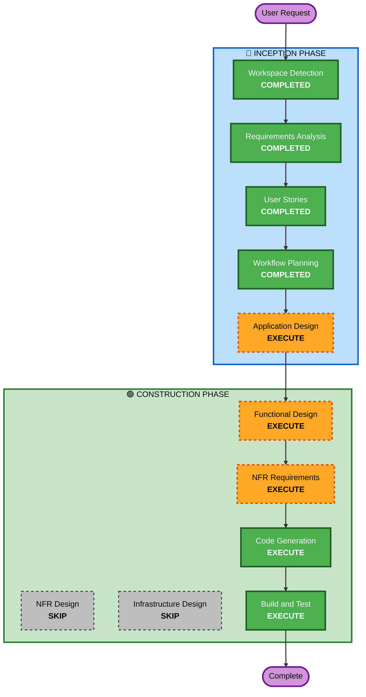

# Execution Plan — Flappy Kiro

## Detailed Analysis Summary

### Change Impact Assessment
- **User-facing changes**: Yes — entire application is a new user-facing game
- **Structural changes**: Yes — new project structure from scratch
- **Data model changes**: Yes — game state, scoring, settings persistence
- **API changes**: No — purely client-side application
- **NFR impact**: Yes — performance (60 FPS), security headers, code quality

### Risk Assessment
- **Risk Level**: Low — greenfield project, no existing systems to break
- **Rollback Complexity**: Easy — no production deployment, no data migration
- **Testing Complexity**: Moderate — game physics, collision detection, difficulty curves need property-based testing

---

## Workflow Visualization



### Text Alternative
```
Phase 1: INCEPTION
- Workspace Detection (COMPLETED)
- Requirements Analysis (COMPLETED)
- User Stories (COMPLETED)
- Workflow Planning (COMPLETED)
- Application Design (EXECUTE)

Phase 2: CONSTRUCTION
- Functional Design (EXECUTE)
- NFR Requirements (EXECUTE)
- NFR Design (SKIP)
- Infrastructure Design (SKIP)
- Code Generation (EXECUTE)
- Build and Test (EXECUTE)

Phase 3: OPERATIONS
- Operations (PLACEHOLDER)
```

---

## Phases to Execute

### 🔵 INCEPTION PHASE
- [x] Workspace Detection (COMPLETED)
- [x] Requirements Analysis (COMPLETED)
- [x] User Stories (COMPLETED)
- [x] Workflow Planning (IN PROGRESS)
- [ ] Application Design - EXECUTE
  - **Rationale**: New game requires component identification — game engine, renderer, physics, collision, audio, UI state machine, scoring module. Need to define component boundaries and interactions.
- [ ] Units Generation - SKIP
  - **Rationale**: Single application with tightly coupled components. All game modules are part of one deployable unit. No benefit from splitting into separate units of work.

### 🟢 CONSTRUCTION PHASE
- [ ] Functional Design - EXECUTE
  - **Rationale**: Game physics (gravity, flap force), collision algorithms, difficulty curves, and state machine transitions need detailed design. PBT-01 requires property identification during this stage.
- [ ] NFR Requirements - EXECUTE
  - **Rationale**: Tech stack decisions (TypeScript tooling, build system, PBT framework selection per PBT-09), performance targets (60 FPS), and security headers (SECURITY-04) need specification.
- [ ] NFR Design - SKIP
  - **Rationale**: No complex NFR patterns to incorporate. Performance is handled by standard Canvas rendering practices. Security headers are straightforward middleware. No infrastructure mapping needed.
- [ ] Infrastructure Design - SKIP
  - **Rationale**: Purely client-side application. No cloud infrastructure, no servers, no deployment architecture needed. Static file hosting only.
- [ ] Code Generation - EXECUTE (ALWAYS)
  - **Rationale**: Implementation planning and TypeScript code generation for all game components.
- [ ] Build and Test - EXECUTE (ALWAYS)
  - **Rationale**: Build instructions, unit tests, property-based tests, and integration testing.

### 🟡 OPERATIONS PHASE
- [ ] Operations - PLACEHOLDER
  - **Rationale**: Future deployment workflows. Not applicable for current scope.

---

## Success Criteria
- **Primary Goal**: Fully playable Flappy Kiro game in the browser
- **Key Deliverables**: TypeScript source, HTML entry point, build configuration, test suite (example-based + PBT)
- **Quality Gates**: 60 FPS performance, accurate collision detection, security headers compliant, all PBT properties passing
